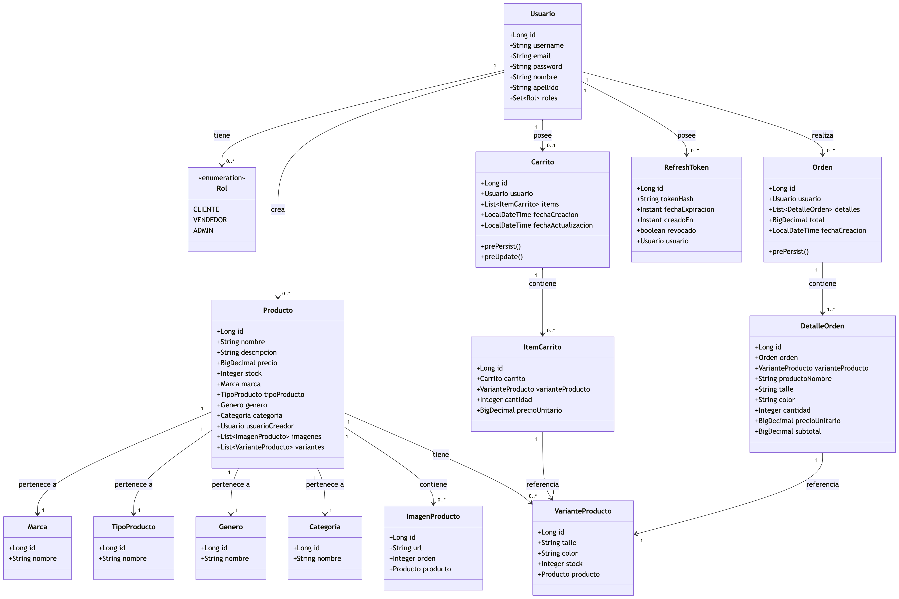
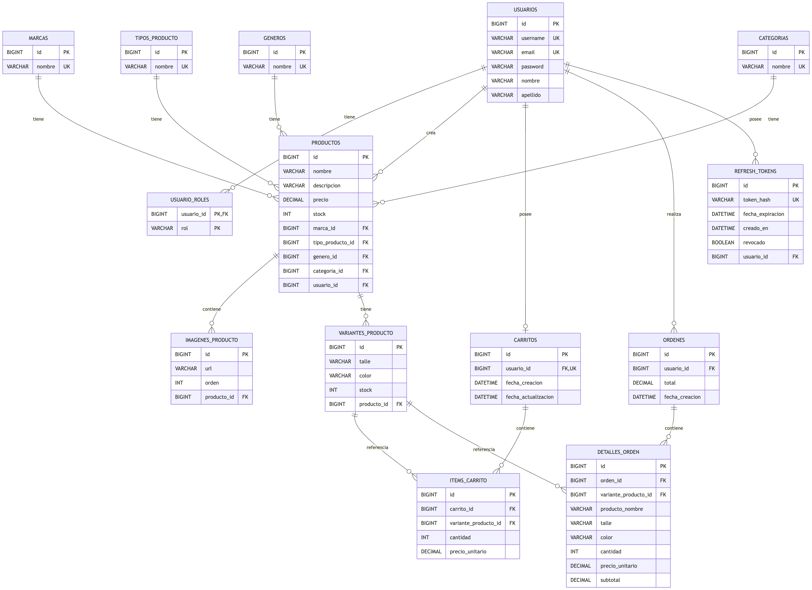

# Zapateria E-Commerce UADE

Trabajo Practico Obligatorio desarrollado para la materia de la UADE. El proyecto consiste en una API REST para un ecommerce de zapateria, donde los usuarios pueden registrarse, iniciar sesion, consultar productos, agregar variantes al carrito y generar ordenes de compra.

La aplicacion esta pensada como backend de una tienda online. Modela productos de calzado y accesorios con marca, categoria, genero, tipo de producto, imagenes y variantes por talle/color, permitiendo controlar el stock de forma mas precisa.

## Objetivo Del Proyecto

El objetivo principal es construir una solucion backend que represente el funcionamiento basico de un ecommerce:

- Gestion de usuarios con roles.
- Autenticacion mediante JWT.
- Publicacion y administracion de productos.
- Catalogo filtrable por categoria.
- Manejo de variantes de producto por talle y color.
- Carrito de compras con validacion de stock.
- Generacion e historial de ordenes.
- Persistencia de datos mediante JPA/Hibernate.
- Documentacion de endpoints con Swagger/OpenAPI.

## Tecnologias Utilizadas

| Area | Tecnologia |
|---|---|
| Lenguaje | Java 21 |
| Framework backend | Spring Boot |
| API REST | Spring Web |
| Persistencia | Spring Data JPA |
| ORM | Hibernate |
| Base de datos | MySQL / H2 para pruebas |
| Seguridad | Spring Security + JWT |
| Documentacion API | Swagger / OpenAPI |
| Build | Maven |
| Contenedores | Docker y Docker Compose |
| Utilidades | Lombok |

## Descripcion General

El sistema esta organizado en una arquitectura por capas:

- **Controller:** expone los endpoints REST.
- **Service:** contiene la logica de negocio.
- **Repository:** accede a la base de datos mediante Spring Data JPA.
- **Model:** define las entidades persistentes.
- **DTO:** estructura los datos de entrada y salida de la API.
- **Security:** configura autenticacion, autorizacion y manejo de tokens JWT.

Los productos se representan como articulos base. Cada producto puede tener varias imagenes y varias variantes. Las variantes son las unidades vendibles reales, ya que contienen talle, color y stock disponible. El carrito y las ordenes trabajan sobre esas variantes.

## Diagramas Del Proyecto

### Diagrama UML

El siguiente diagrama muestra las clases principales del dominio, sus atributos y relaciones. Representa el modelo orientado a objetos utilizado en el codigo Java.



### Diagrama Entidad-Relacion

El DER muestra la estructura de la base de datos, incluyendo tablas, claves primarias, claves foraneas y cardinalidades entre entidades.



## Entidades Principales

- **Usuario:** representa a las personas registradas en el sistema. Puede tener roles como CLIENTE, VENDEDOR o ADMIN.
- **Producto:** representa el articulo publicado en el catalogo.
- **VarianteProducto:** define la combinacion concreta de talle, color y stock.
- **ImagenProducto:** almacena las imagenes asociadas a cada producto.
- **Marca, Categoria, Genero y TipoProducto:** clasifican los productos del catalogo.
- **Carrito:** pertenece a un usuario y contiene los productos que desea comprar.
- **ItemCarrito:** representa una variante agregada al carrito con una cantidad determinada.
- **Orden:** representa una compra confirmada por un usuario.
- **DetalleOrden:** guarda el detalle historico de cada producto comprado.
- **RefreshToken:** permite renovar la sesion del usuario de forma segura.

## Funcionalidades

- Registro e inicio de sesion de usuarios.
- Asignacion de roles.
- Creacion, edicion, eliminacion y consulta de productos.
- Consulta de catalogo y detalle de productos.
- Administracion de imagenes y variantes.
- Agregado, actualizacion y eliminacion de items del carrito.
- Validacion de stock antes de comprar.
- Creacion de ordenes de compra.
- Consulta de historial de ordenes.
- Documentacion automatica de la API.

## Como Ejecutar El Proyecto

La documentacion tecnica con pasos de ejecucion, endpoints, perfiles de configuracion, Docker, Swagger y pruebas se encuentra en:

[README tecnico del backend](ecommerce-zapateria/README.md)

## Estructura General

```text
.
├── docker-compose.yml
├── README.md
├── docs/
│   └── diagramas/
│       ├── DER.png
│       └── UML.png
└── ecommerce-zapateria/
    ├── pom.xml
    ├── Dockerfile
    └── src/
        ├── main/
        └── test/
```

## Conclusion

Este trabajo practico implementa el backend de un ecommerce de zapateria aplicando conceptos de programacion orientada objetos, persistencia relacional, arquitectura en capas, seguridad con tokens y documentacion de APIs REST.

El modelo permite representar de forma clara el ciclo principal de una tienda online: usuarios, catalogo, variantes con stock, carrito y ordenes de compra.
